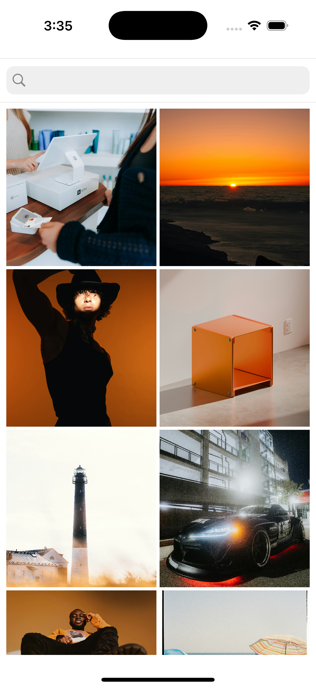
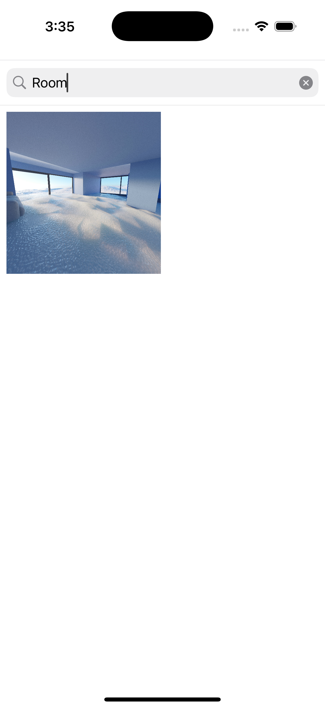
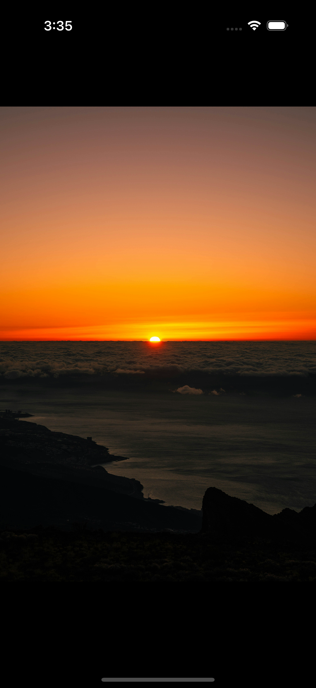

# Image Gallery App (iOS)

An iOS app that fetches and displays a list of images from a public API like **Unsplash**, presented in a scrollable grid layout using `UICollectionView`. Users can **search**, **view** full-screen images, and enjoy **image caching** via SDWebImage.

---

## Features

- Fetch images from Unsplash API
- Search images by its slug
- Display in a responsive `UICollectionView` grid layout
- Tap to view images full-screen
- Image caching using **SDWebImage**
- Clean MVVM architecture

---

## Tech Stack

- UIKit
- Alamofire
- UICollectionView (Grid Layout)
- UISearchBar
- SDWebImage (for async image loading & caching)
- MVVM Architecture

---
## Dependencies
- SDWebImage
- Alamofire

---

## Screenshots

### Gallery Grid View

### Search Results

### Full-Screen Image View

